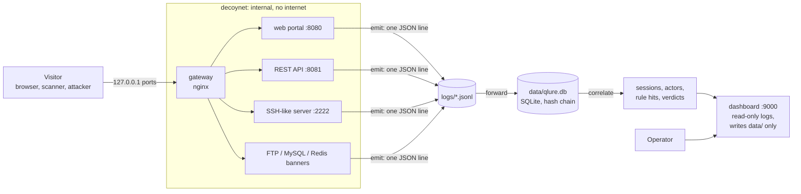

# 1. Overview

Q-Lure runs fake but harmless services, records what visitors do, groups those actions into
sessions, scores each session with readable rules, and shows the operator why a session was
flagged. Everything is built from real interactions captured against our own decoys. No
generated or simulated data is used for evaluation.

## The big picture

Two boundaries matter most:

1. **Decoys cannot reach out.** They sit on a Docker network with no internet route. Only the
   gateway touches both networks, and it only forwards traffic in.
2. **Decoys cannot be read back.** The dashboard and forwarder read the logs; they never write
   to them. Decoys only append.

## The parts

| Part | Folder | What it does | Key files |
|---|---|---|---|
| Event contract | `qlure/events/` | The Pydantic `Event` model, `emit()`, and the JSON Schema export | `schema.py`, `emit.py`, `docs/event.schema.json` |
| Decoys | `decoys/` | Web portal, REST API, SSH-like server, FTP/MySQL/Redis banners, fake file tree, honeytokens | `web/app.py`, `api/app.py`, `ssh/server.py`, `banners/listeners.py` |
| Gateway | `gateway/` | nginx: the only container on both networks, relays HTTP and raw TCP | `nginx.conf` |
| Forwarder and store | `qlure/store/` | Tails the JSONL files into SQLite, chains each event by SHA-256 | `forwarder.py`, `db.py`, `chain.py`, `verify.py` |
| Correlation | `qlure/correlate/` | Sessions, actors, rules, scoring, verdicts, plain-language explanations | `sessions.py`, `actors.py`, `rules.py`, `engine.py`, `explain.py` |
| Rules | `qlure/rules/` | Eleven rules (R1 to R11), their weights, thresholds, ATT&CK labels and default-credential and scanner lists | `rules.yaml` |
| Dashboard | `dashboard/` | Session and actor views, rule cards, evidence export, printable report, settings | `app.py`, `data.py`, `auth.py`, `templates/` |
| Settings | `qlure/settings.py` | The only changes an operator may make, validated and audited | `settings.py` |
| Capture and evaluation | `qlure/capture.py`, `replay.py`, `evaluate.py` | Record labelled runs, replay request files, compute precision and recall | `cli.py` |
| Extras | `qlure/pqc/`, `qlure/ml/` | Post-quantum checkpoint signing, SSH key-exchange fingerprint, learned second opinion | see [page 8](08-extras-pqc-and-ml.md) |
| Command line | `qlure/cli.py` | One entry point for every operation | `schema, validate, forward, verify, correlate, capture, replay, eval, ml, keygen, sign` |

## Status at a glance

- Phases 0 to 6 are in place, plus the learned second opinion.
- Six decoy services run behind the gateway: web, API, SSH-like, and FTP, MySQL and Redis banners.
- The pipeline is tested end to end on real captured runs.
- Recall on the first real-tool run was very low. See [page 10](10-known-limits.md) before
  drawing conclusions about detection quality.

## Where to go next

- To follow one request through the system, read [page 2](02-data-flow.md).
- To understand why a session got its verdict, read [page 5](05-correlation-and-verdicts.md).
