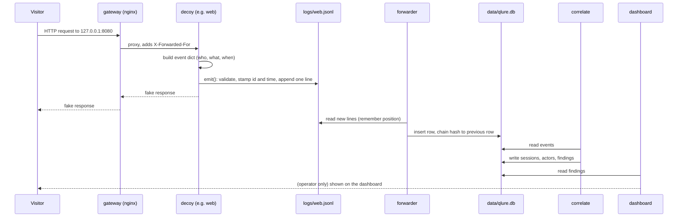

# 2. Data flow

This page follows one visitor request through the whole system. The steps are in the order the
code runs them.

## Step by step

### 1. The visitor arrives at the gateway

Each visitor-facing port is published on `127.0.0.1` only, so only processes on the operator's
machine can reach the decoys. The gateway is nginx:

- **HTTP** (8080, 8081) is proxied to the web and API decoys. It adds `X-Forwarded-For` with the
  real client address.
- **Raw TCP** (2222, 2121, 3306, 6379) uses nginx's stream module with the PROXY protocol. It
  writes a one-line header carrying the visitor's address before the real bytes, so the decoy
  learns the true source.

### 2. The decoy handles the request

The decoy answers from fixed, fake content. It never runs the visitor's input. For HTTP it looks
at the path, query, body and headers. For SSH it reads commands and answers from a fake file
tree. For banners it reads the first bytes and closes.

### 3. The decoy records the event

Every decoy records through one function, `emit()` in `qlure/events/emit.py`:

1. Adds an `event_id` (random hex) and a `ts` (UTC now), unless the caller set them.
2. Validates the whole event against the Pydantic `Event` model. Invalid data raises an error,
   so a decoy cannot write a malformed line.
3. Appends one JSON line to `logs/<service>.jsonl` under a lock.

Each event says who (`src_ip`, `client_fp`, `session_id`), which service, which action (`connect`,
`http_request`, `login_attempt`, `command`, `honeytoken_use`, and so on), and what was sent and
answered.

### 4. The forwarder stores it

`qlure forward` reads the JSONL files and inserts new lines into SQLite. For each event it
computes `hash = SHA-256(previous_hash + "\n" + canonical_json)`, so every row depends on all
the rows before it. Read [page 4](04-storage-and-integrity.md) for why this matters.

`qlure forward --follow` (used in the Docker compose file) keeps polling. The native loop used
by the operator runs `forward` and `correlate` every 10 seconds instead.

### 5. Correlation groups and scores

`qlure correlate` reads the stored events and does three things:

1. **Sessions**: groups events from the same visitor on the same service (see page 5).
2. **Actors**: links sessions that share strong evidence (see page 5).
3. **Rules and verdicts**: runs R1 to R10, sums the weights, applies suppressors, picks a verdict,
   and writes a plain-language explanation.

Results go to the `sessions`, `actors` and `findings` tables. Correlation rebuilds them from
scratch each run, so changing a rule weight takes effect on the next run.

### 6. The dashboard shows it

The dashboard only reads `findings` and the events they cite. It shows the verdict, the rule
cards with thresholds and measured values, and an evidence timeline with each event's hash. The
evidence export carries the hash-chain check so an investigator can confirm nothing was edited.

## Why it is shaped this way

- **One write path.** Only `emit()` writes events, so there is one place to validate and one
  place to reason about.
- **Append only.** Decoys only append. A decoy compromise cannot silently rewrite history, and
  the hash chain makes any later edit visible.
- **Decoupled stages.** The forwarder, correlator and dashboard are separate. Each can be rerun
  without touching the decoys.
