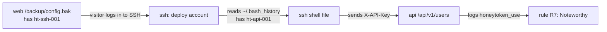

# 3. Decoys

A decoy is a fake service that looks real enough to hold a visitor's attention and records
everything they do. Each decoy:

- answers only from **fixed, fake content** (no real data, no real database);
- **never executes** visitor input (no `exec`, `eval`, `subprocess` in `decoys/`);
- writes every interaction through `emit()` (see [page 2](02-data-flow.md));
- runs read-only, as a non-root user, with all Linux capabilities dropped.

The company in the fake content is "Veltrix Logistics". It is set in `runtime/content.json` and
can be changed from the dashboard settings page (see [page 6](06-dashboard-and-settings.md)).

## The services

| Decoy | Port (host) | Container | Protocol | What a visitor sees | Events logged |
|---|---|---|---|---|---|
| Web portal | 8080 | `web` | HTTP | A login page, an admin page, a backup folder | `http_request`, `login_attempt`, `file_read` |
| REST API | 8081 | `api` | HTTP (JSON) | `/api/v1/users`, `/api/v1/users/{id}`, `/api/v1/orders`, all requiring a key | `api_call`, `honeytoken_use` |
| SSH-like server | 2222 | `ssh` | SSH (AsyncSSH) | A login prompt and a fake shell with a fake file tree | `connect`, `login_attempt`, `command`, `disconnect` |
| FTP banner | 2121 | `banners` | FTP | A greeting banner, then closes | `connect`, `banner` |
| MySQL banner | 3306 | `banners` | MySQL | A server greeting, then closes | `connect`, `banner` |
| Redis banner | 6379 | `banners` | Redis | No greeting; reads the first bytes, then closes | `connect`, `banner` |

## Web portal (`decoys/web/app.py`)

- `/` and `/login`: a login form. Each `POST /login` logs the username and password exactly as
  typed, and always answers "invalid" with a 401.
- `/admin`: a fake admin page.
- `/.env`: returns a fake `.env` file containing planted secrets (`ht-aws-001`, `ht-db-001`).
  Logs a `file_read`.
- `/backup/` and `/backup/config.bak`: a backup folder. The config file contains the planted SSH
  password (`ht-ssh-001`).
- `/api*` and everything else: an error page, logged as `http_request`.

Requests larger than 64 KB are refused at the gateway (`client_max_body_size 64k`).

## REST API (`decoys/api/app.py`)

- Every request is logged, including the path, query, selected headers and response status.
- Routes under `/api/v1/` require a planted key in one of two headers:
  - `X-API-Key` must equal the value of `ht-api-001`;
  - `X-AWS-Access-Key` must equal the value of `ht-aws-001`.
- A request carrying a planted key is logged as `honeytoken_use` and `api_call`, on any path
  (not only `/api/v1/`). This is how the honeytoken chain ends.

## SSH-like server (`decoys/ssh/server.py`, `shell.py`)

- Built on AsyncSSH, so the handshake looks like real SSH to a normal client.
- Only the planted password `ht-ssh-001` signs in, for the `deploy` account. Every attempt is
  logged as `login_attempt`. A successful login is also logged as `login_success` and
  `honeytoken_use`, so **a single SSH login with the planted password triggers rule R7** (60,
  Noteworthy on its own).
- The shell answers 48 commands from fixed text (`ls`, `cat`, `id`, `ps`, `history`, and so on).
  Anything else returns "command not found". Nothing is executed.
- The fake file tree (`decoys/fakefs/fs.yaml`) includes `/home/deploy/.bash_history`, which
  contains the planted API key (`ht-api-001`). Reading it is how a visitor finds the next secret.

## Banners (`decoys/banners/listeners.py`)

- FTP sends a greeting (its text comes from `runtime/content.json`), reads the first bytes, and closes.
- MySQL sends a version greeting, reads the first bytes, and closes.
- Redis reads the first bytes and closes, with no greeting.
- Each listener reads the gateway's PROXY line first, so events carry the real visitor address.

These listeners are deliberately shallow. They catch port scans and banner grabs, not full sessions.

## Honeytokens: the planted chain

All fake secrets are in [decoys/honeytokens.yaml](../../decoys/honeytokens.yaml). Each one
contains the word "decoy" so it is easy to spot in any log.

| Id | Kind | Planted in | Accepted by |
|---|---|---|---|
| `ht-aws-001` | AWS-style key | web `/.env` | api (`X-AWS-Access-Key`) |
| `ht-db-001` | database password | web `/.env` | nothing yet (planted only) |
| `ht-ssh-001` | SSH password | web `/backup/config.bak` | ssh (user `deploy`) |
| `ht-api-001` | API key | ssh `~/.bash_history` | api (`X-API-Key`) |

A visitor who uses any accepted secret triggers rule R7, which by itself scores 60 and is
therefore Noteworthy (see [page 5](05-correlation-and-verdicts.md)). Planted-only secrets like
`ht-db-001` are not accepted anywhere, so using them does not trigger R7; they only show up when
a visitor reads them through `/.env` (rule R9).

## Where the decoy code lives

| File | Role |
|---|---|
| `decoys/common.py` | Shared helpers, including PROXY-line parsing |
| `decoys/content.py` | Reads the fake company name and FTP banner from `runtime/content.json` |
| `decoys/honeytokens.py` | Loads `honeytokens.yaml` |
| `decoys/fakefs/fs.yaml` | The SSH shell's fake file tree |
| `decoys/*/README.md` | One-line owner notes per decoy |
