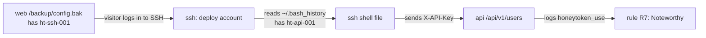

# 3. Decoys

A decoy is a fake service that looks real enough to hold a visitor's attention and records
everything they do. Each decoy:

- answers only from **fixed, fake content** (no real data, no real database);
- **never executes** visitor input (no `exec`, `eval`, `subprocess` in `decoys/`);
- writes every interaction through `emit()` (see [page 2](02-data-flow.md));
- runs read-only, as a non-root user, with all Linux capabilities dropped.

The company in the fake content is "Veltrix Logistics". It is set in `runtime/content.json` and
can be changed from the dashboard settings page (see [page 6](06-dashboard-and-settings.md)).

## The services

| Decoy | Port (host) | Container | Protocol | What a visitor sees | Events logged |
|---|---|---|---|---|---|
| Web portal | 8080 | `web` | HTTP | A login page, planted backup and `.env` files, fake git files, a phpMyAdmin login, an upload sink | `http_request`, `login_attempt`, `honeytoken_use`, `file_read` |
| REST API | 8081 | `api` | HTTP (JSON) | `/api/v1/users`, `/api/v1/users/{id}`, `/api/v1/orders`, all requiring a key | `http_request`, `api_call`, `login_attempt`, `honeytoken_use` |
| SSH-like server | 2222 | `ssh` | SSH (AsyncSSH) | A login prompt and a fake shell with a fake file tree | `connect`, `login_attempt`, `login_success`, `honeytoken_use`, `command`, `disconnect` |
| FTP banner | 2121 | `banners` | FTP | A greeting, then a short login dialogue | `connect`, `banner`, `login_attempt`, `honeytoken_use` |
| MySQL banner | 3306 | `banners` | MySQL | A server greeting, then a short login dialogue | `connect`, `banner`, `login_attempt` |
| Redis banner | 6379 | `banners` | Redis | No greeting; fixed replies to a short command dialogue | `connect`, `banner`, `login_attempt`, `honeytoken_use`, `command` |

## Web portal (`decoys/web/app.py`)

- `/` redirects to `/login`. Each `POST /login` logs the username and password as sent (length
  capped) as `login_attempt`, and always answers 401 "Invalid username or password."
- A planted SSH or database password typed into the login form also logs `honeytoken_use`: the
  SSH password `ht-ssh-001` (user `deploy`) and the database password `ht-db-001` (any user).
  The visible reply stays the same 401 page.
- `/admin` redirects to `/login`.
- `/.env`: a fake `.env` with the planted AWS key and database password (`ht-aws-001`, `ht-db-001`).
  Logs a `file_read`.
- `/backup/` and `/backup/config.bak`: a backup folder. The config file contains the planted SSH
  password (`ht-ssh-001`).
- `/.git/HEAD` and `/.git/config`: fake git files. The remote URL in the config carries the planted
  git token (`ht-git-001`). Each read logs a `file_read`.
- `/robots.txt`, `/uploads` and `/uploads/`: fixed text and a fixed directory listing.
- `/phpmyadmin` and `/pma` (with or without a trailing slash or `index.php`): a login form. A `POST`
  is a failed login, logged as `login_attempt`.
- `/server-status`: a 403 page.
- `/upload` (`POST` or `PUT`): always 403. Nothing is stored. The middleware logs the size, SHA-256
  and a 2 KB preview of the body.
- `/download?file=`: reads only from the SSH shell's fake file tree (`decoys/fakefs/fs.yaml`), never
  the host. The same root-only paths the shell refuses (shadow, sudoers, `/root`) return 403. Other
  fake files return their fake text and log a `file_read`. Unknown names return 404.
- `/api*`: a 401 JSON reply. Everything else: a 404 page, logged as `http_request`.

Requests larger than 64 KB are refused (413) at the gateway and by the decoy (`client_max_body_size 64k`).

## REST API (`decoys/api/app.py`)

- Every request is logged as `http_request`, with the path, query, selected headers, status, body
  length, body SHA-256 and a 2 KB body preview.
- Routes under `/api/v1/` require a planted key in one of two headers:
  - `X-API-Key` must equal the value of `ht-api-001`;
  - `X-AWS-Access-Key` must equal the value of `ht-aws-001`.
- A request carrying a planted key is logged as `honeytoken_use`, on any path. Requests under
  `/api/v1/` are also logged as `api_call`. This is how the honeytoken chain ends.
- A request that presents a key which is not planted is logged as `login_attempt`, with the
  username `api-key` and the presented key as the password. Key guessing therefore counts toward
  rule R3. A request with no key at all is not logged as a login.

## SSH-like server (`decoys/ssh/server.py`, `shell.py`)

- Built on AsyncSSH, so the handshake looks like real SSH to a normal client.
- Only the planted password `ht-ssh-001` signs in, for the `deploy` account. Every attempt is
  logged as `login_attempt`. A successful login is also logged as `login_success` and
  `honeytoken_use`, so **a single SSH login with the planted password triggers rule R7** (60,
  Noteworthy on its own).
- The shell answers 59 commands from fixed text (`ls`, `cat`, `id`, `ps`, `history`, and so on).
  File commands give realistic errors: `Permission denied` for root-only files and `No such file or
  directory` for missing ones. Any other command returns "command not found". Nothing is executed.
- The fake file tree (`decoys/fakefs/fs.yaml`) holds the planted values, for example:
  `/home/deploy/.bash_history` (`ht-api-001`), `/home/deploy/.ssh/id_rsa` (`ht-sshkey-001`, a
  placeholder body), `/home/deploy/app/config.yaml` (`ht-redis-001`) and
  `/home/deploy/app/backup.sh` (`ht-canary-001`). Reading them is how a visitor finds the next secret.

## Banners (`decoys/banners/listeners.py`, `dialogues.py`)

The FTP, MySQL and Redis listeners run short, bounded dialogues: at most 8 commands and 10 seconds
per connection, then they close. Each one reads the gateway's PROXY line first, so events carry
the real visitor address.

- **FTP:** sends a greeting (its text comes from `runtime/content.json`). `USER` gets a
  password prompt. Each `PASS` is logged as `login_attempt` and always answered "530 Login
  incorrect". A password that matches a planted FTP, SSH or database secret (`ht-ssh-001`,
  `ht-db-001`) also logs `honeytoken_use`.
- **MySQL:** sends an 8.0 greeting and reads the login packet. The attempt is logged as
  `login_attempt` (the password only when it matches a default pair) and always answered with
  access denied. No planted secret is accepted here.
- **Redis:** sends no greeting. Commands get `NOAUTH` until `AUTH` is used. `AUTH` with the
  planted password `ht-redis-001` logs `honeytoken_use` and unlocks fixed replies (`PING`, `INFO`,
  `KEYS`, and so on). Other passwords get `WRONGPASS`. Every command is logged as `command`, and
  rule R11 judges the risky ones.

These listeners are deliberately shallow. They are not real protocol servers and do not run
real commands.

## Honeytokens: the planted chain

All fake secrets are in [decoys/honeytokens.yaml](../../decoys/honeytokens.yaml). Each one
contains the word "decoy" so it is easy to spot in any log.

| Id | Kind | Planted in | Accepted by |
|---|---|---|---|
| `ht-aws-001` | AWS-style key | web `/.env` | api (`X-AWS-Access-Key`) |
| `ht-db-001` | database password | web `/.env` | web login and FTP (password only) |
| `ht-ssh-001` | SSH password (user `deploy`) | web `/backup/config.bak` | ssh; web login and FTP (user `deploy`) |
| `ht-api-001` | API key | ssh `~/.bash_history` | api (`X-API-Key`) |
| `ht-git-001` | git token | web `/.git/config` | nothing (planted only) |
| `ht-sshkey-001` | SSH private key (placeholder) | ssh `~/.ssh/id_rsa` | nothing (planted only) |
| `ht-redis-001` | Redis password | ssh `app/config.yaml` | redis (`AUTH`) |
| `ht-canary-001` | canary URL | ssh `app/backup.sh` | nothing (planted only; no alert is wired up yet) |

A visitor who uses any accepted secret triggers rule R7, which by itself scores 60 and is
therefore Noteworthy (see [page 5](05-correlation-and-verdicts.md)). Planted-only secrets such as
`ht-git-001`, `ht-sshkey-001` and `ht-canary-001` are not accepted anywhere, so using them does
not trigger R7. They show up when a visitor reads them, and reading sensitive paths such as
`/.git` or `id_rsa` triggers rule R9.

## Where the decoy code lives

| File | Role |
|---|---|
| `decoys/common.py` | Shared helpers, including PROXY-line parsing |
| `decoys/content.py` | Reads the fake company name and FTP banner from `runtime/content.json` |
| `decoys/honeytokens.py` | Loads `honeytokens.yaml` |
| `decoys/fakefs/fs.yaml` | The SSH shell's fake file tree, also served by `/download` |
| `decoys/web/templates/` | Fixed text for robots, git, phpMyAdmin and error pages |
| `decoys/*/README.md` | One-line owner notes per decoy |
