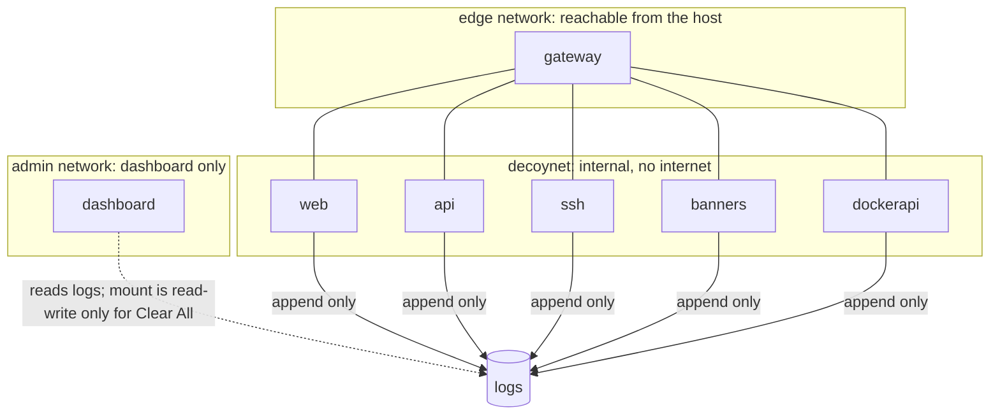

# 7. Security model

Q-Lure is designed so that an attacker who reaches a decoy learns nothing real and can do nothing
real. Every safety rule below is either enforced by the setup or checked by the tests.

## Rules that always hold

1. **Emulate, never execute.** No `exec`, `eval`, `subprocess` or real database in `decoys/`.
2. **No real secrets.** Every planted value is in `decoys/honeytokens.yaml` and is fake, and each
   one contains the word "decoy".
3. **No internet from decoys.** They sit on `decoynet`, which is an internal Docker network.
4. **Logs stay out of git.** They hold visitor IPs and typed text.
5. **Evaluation uses real traffic only.** Never simulated data.

## Isolation

- Only the **gateway** is on both networks. Visitors reach the decoys through it, and the decoys
  cannot start a connection to anything outside.
- The **dashboard** is on its own `admin` network, not the decoy network. It cannot reach a decoy.
- Published ports are bound to `127.0.0.1`. The decoys are not reachable from other machines on
  the network.

## Container hardening

From `docker-compose.yml`:

| Control | Applied to | Effect |
|---|---|---|
| `read_only: true` | all decoys, dashboard, forwarder | the filesystem cannot be changed, except tmpfs `/tmp` |
| `cap_drop: [ALL]` | all | no Linux capabilities |
| `no-new-privileges` | all | a process cannot gain privileges |
| `user: 101:101` | gateway | the gateway runs as a non-root user |
| `mem_limit`, `cpus`, `pids_limit` | every service | a flood cannot exhaust the host |
| `network_mode: none` | forwarder | it reads files only and needs no network |
| `internal: true` | decoynet | no route out |

## Where the logs go

- Decoys **append** to `logs/`. They never read it back.
- The forwarder **reads** `logs/` and the compose file mounts it read-only for it. The dashboard
  reads `logs/` too, but its mount is read-write, because Clear All empties the files (audited).
  `qlure prune` also rewrites the archive, so it needs write access to `logs/`.
- The forwarder writes events to `data/qlure.db`. Correlation (the dashboard buttons and live pass,
  or `qlure correlate`) writes sessions, actors and findings there, and `qlure prune`, `qlure sign`
  and the config audit write there too. The dashboard writes `data/settings.json`.

## Tamper evidence

Any edit to stored or archived events is detectable: the hash chain breaks, and `qlure verify`
reports the first bad event. Signed checkpoints add protection even when someone rewrites both the
database and the archive (see [page 8](08-extras-pqc-and-ml.md)).

## Replay

`qlure replay` sends saved requests to the decoys. Replayed events could otherwise let a visitor
choose the timestamp they appear under, so the decoys **ignore replay times** unless the request
carries the secret `QLURE_REPLAY_TOKEN`. Keep that token secret.

## PROXY protocol: required, or optional on localhost

The SSH and FTP/MySQL/Redis decoys trust the gateway's PROXY v1 line for the visitor address.
`QLURE_PROXY_PROTOCOL` (or `--proxy-protocol`) selects the mode:

- `required` (default, and what Docker uses): a connection without a valid PROXY line is dropped.
  Only the gateway can reach these ports, so the claimed address is the gateway's word.
- `optional`: a valid PROXY line is still used; any other connection is a direct client and its
  socket address (`127.0.0.1`) is the source. This is for `tools/run_live.py` on one computer.

**Risk:** in `optional` mode any client can send a forged PROXY line and claim any source address,
so the recorded IP is not evidence. Never use it on an exposed interface. The decoys refuse to start
(non-zero exit) when `optional` is set and `QLURE_BIND_HOST` / `--host` is not a loopback address.
Invalid values fall back to `required`. The compose files never set it.

## Things that are not protections

- The dashboard password is a single shared secret, not user accounts.
- Container isolation is the boundary. The decoys are not hardened against an attacker who escapes
  Docker; that is outside what this project covers.
- Verifying the chain proves the stored record is unchanged. It does not prove the visitor was
  who the IP address says.
